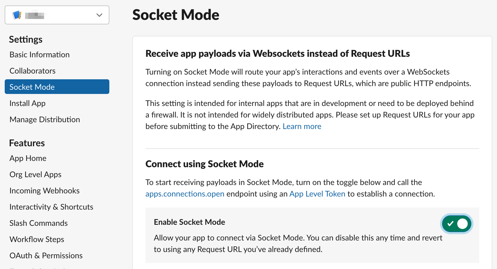
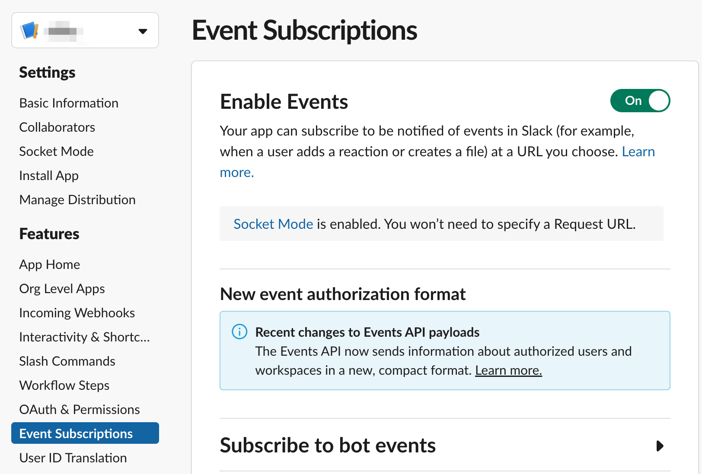
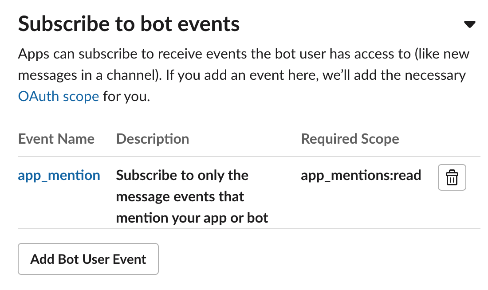

## Create Slack App

1. [Go to Slack API](https://api.slack.com/)
2. [Create an app](https://api.slack.com/apps?new_app=1): Open Your Apps
   1. 
3. [**Features > OAuth & Permissions**] Set Scope
   1. 
4. [**Install App to your Team**]
   1. 
5. [**Installed App Settings**]
   1. 

Get `SLACK_BOT_TOKEN`:

```
SLACK_BOT_TOKEN=xoxb-****
```

## Activate Socket Mode: Generate App Token

* https://api.slack.com/apis/connections/socket#token


1. [**Settings > Basic Information > App-Level Tokens**]
    * 
    * 
    * 

Get `SLACK_APP_TOKEN`:

```
SLACK_APP_TOKEN=xapp-*****
```

[**Settings > Socket Mode**]

Enable Socket Mode




## Pssssss

1. [**Features > Event Subscription**]
   
2. **Subscribe to bot events** `app_mentions`
   


## App Manifest

```yaml
display_information:
  name: botName
features:
  bot_user:
    display_name: botName
    always_online: false
oauth_config:
  scopes:
    bot:
      - app_mentions:read
      - chat:write
      - reactions:write
settings:
  event_subscriptions:
    bot_events:
      - app_mention
  interactivity:
    is_enabled: true
  org_deploy_enabled: false
  socket_mode_enabled: true
  token_rotation_enabled: false
```