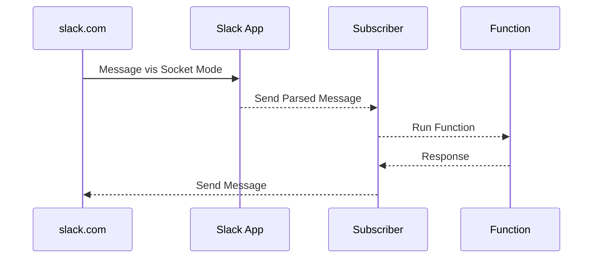

# @himenon/template-slack-bolt

Slack App template to be created with slack bolt.
This sample uses [Socket Mode](https://api.slack.com/apis/connections/socket) to retrieve messages.

## Development

- [Set Slack App](./SETUP_SLACK_APP.md)

**Install**

```bash
pnpm install
```

**Watch**

```bash
pnpm watch
```

**Build**

```bash
pnpm build
```

**Build Docker Image**

```bash
docker build . -t ghcr.io/himenon/template-slack-bolt:local
```

**Docker Run**

```bash
docker run --rm --env-file=.env.production ghcr.io/himenon/template-slack-bolt:local
docker compose up

# Deamon
docker run --rm --env-file=.env.production -d ghcr.io/himenon/template-slack-bolt:local
docker compose up -d
```

### Environment File

`.env`

```
VERSION=1.0.1
```

`.env.production`

```
SLACK_APP_TOKEN=xapp-****
SLACK_BOT_TOKEN=xoxb-****
```

## Architecture

**Basic**



| Name       | FileName                           |
| :--------- | :--------------------------------- |
| slack.com  | -                                  |
| Slack App  | `src/slack/server.ts`              |
| Subscriber | `src/subscriber/index.ts`          |
| Function   | `src/subscriber/index.ts` (Method) |

## Release

- Automatic version updates are performed when merged into the `main` branch.

## License

[@himenon/template-slack-bolt](https://github.com/Himenon/template-slack-bolt)・MIT
